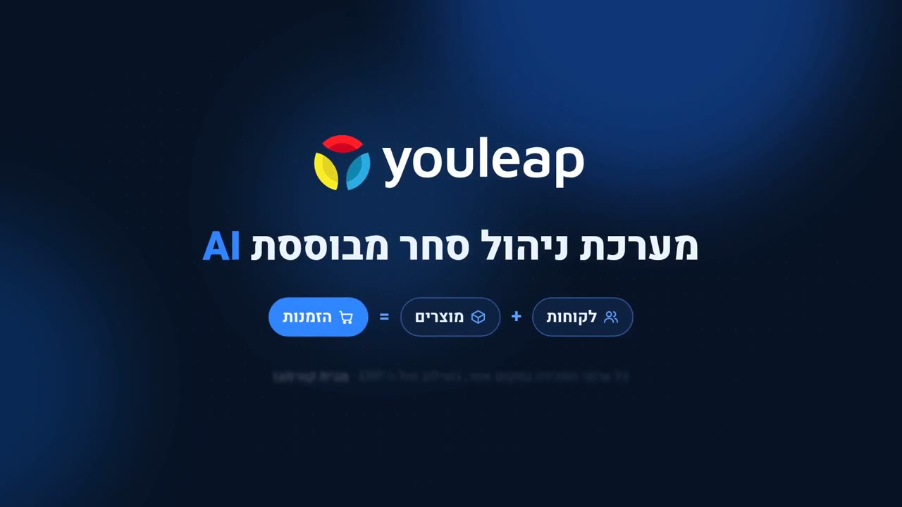

# סרטון השקה ליוליפ (Youleap)

[](videos/youleap-2min.mp4)

*לחיצה על התמונה פותחת את גרסת 2 הדקות.*

סרטון בעברית שמסביר מה זה יוליפ, למי זה מתאים ואיך זה עובד, עם הדגמה של הפורטל האמיתי וקריינות.
יש שתי גרסאות:

| גרסה | אורך | למה מתאימה | קובץ |
|---|---|---|---|
| קצרה | 60 שניות | לינקדאין, פנייה ראשונה בוואטסאפ או במייל | [videos/youleap-60s.mp4](videos/youleap-60s.mp4) |
| מלאה | 2 דקות | אחרי שיחת היכרות, לפני פגישה, או להעברה בתוך הארגון של הלקוח | [videos/youleap-2min.mp4](videos/youleap-2min.mp4) |

## רוצה רק לצפות?
נכנסים לתיקייה **videos**, לוחצים על הסרטון, ואז על **View raw** או **Download**.

## מה יש בכל תיקייה

| תיקייה | מה יש בה | למי |
|---|---|---|
| `videos` | הסרטונים המוכנים | לכולם |
| `script` | התסריט: מה הקריין אומר בכל סצנה, וטקסט מוכן לפוסט | למי שרוצה לקרוא או להקליט מחדש |
| `source` | הקבצים שמהם הסרטון נבנה | רק למי שעורך ומרנדר מחדש |

**script**
- `narration-2min.md` התסריט של גרסת 2 הדקות, לפי סצנות וזמנים
- `narration-60s.md` התסריט של גרסת 60 השניות
- `share-text.md` טקסט מוכן לפוסט

**source** (לעריכה בלבד)
- `scenes/` עמוד אינטרנט אחד שמכיל את כל הסצנות והאנימציות (`index.html`), והתזמונים שלהן (`cues.js`)
- `scenes/portal/` מסכי הפורטל שמופיעים בהדגמה, שמורים כעמודים סטטיים
- `scenes/assets/` לוגו, לוגואים של לקוחות, תמונה ופונטים
- `render/` הופך את העמוד לסרטון, פריים אחרי פריים
- `audio/` יוצר את המוזיקה ומשלב אותה עם הקריינות
- `voice/` יוצר את הקריינות מהתסריט

## מבנה הסרטון (גרסת 2 הדקות)

1. **פתיחה** "ה־ERP שלכם מצוין, אבל המכירות לא סובלים אותו"
2. **הבעיה** אותו מוצר מנוהל ב־7 עד 8 ערוצים, ואיפה זה כואב
3. **למי זה מתאים** יבואנים, יצרנים, מפיצים ורשתות עם ERP
4. **מה זה יוליפ ואיך זה עובד** יושבת מעל ה־ERP: שואבת, מאחדת, מחברת
5. **הדגמה בפורטל** טאבלט הסוכן, נטישה שקטה, הכנה לפגישה עם עוזר AI, לקוח 360, קטלוג, תובנות ומבצעים
6. **הזמנות בלי הקלדה** בוט וואטסאפ ו־OCR (המחשה, לא מסך מהפורטל)
7. **מה מבדיל, מותגים שבחרו ופרטי קשר**

## חשוב לדעת
- **הנתונים בפורטל הם נתוני דמו.** שמות הלקוחות והסכומים הוחלפו לפני הצילום.
- **הקול בקריינות** נוצר במודל קוד פתוח לעברית (Phonikud) שהרישיון שלו לשימוש לא מסחרי. לגרסה שיוצאת ללקוחות כדאי להחליף לקול מוקלט או לשירות מסחרי. התסריט והתזמונים כבר מוכנים לזה.
- **סצנת ההזמנות בוואטסאפ ו־OCR** היא המחשה שנבנתה לפי המצגת, כי אין לה מסך בפורטל.

## איך מרנדרים מחדש (למי שעורך)
צריך Python 3, ffmpeg ו־Playwright עם Chromium.

```
cd source/render
python3 render.py video long  ../../videos/new-2min.mp4    # גרסת 2 הדקות, בלי אודיו
python3 render.py video short ../../videos/new-60s.mp4     # גרסת 60 השניות, בלי אודיו
python3 render.py stills long 5,30,60 preview/            # צילום פריימים לבדיקה מהירה
```
את השמע (מוזיקה וקריינות) מחברים אחר כך עם הסקריפטים בתיקייה `source/audio`.
